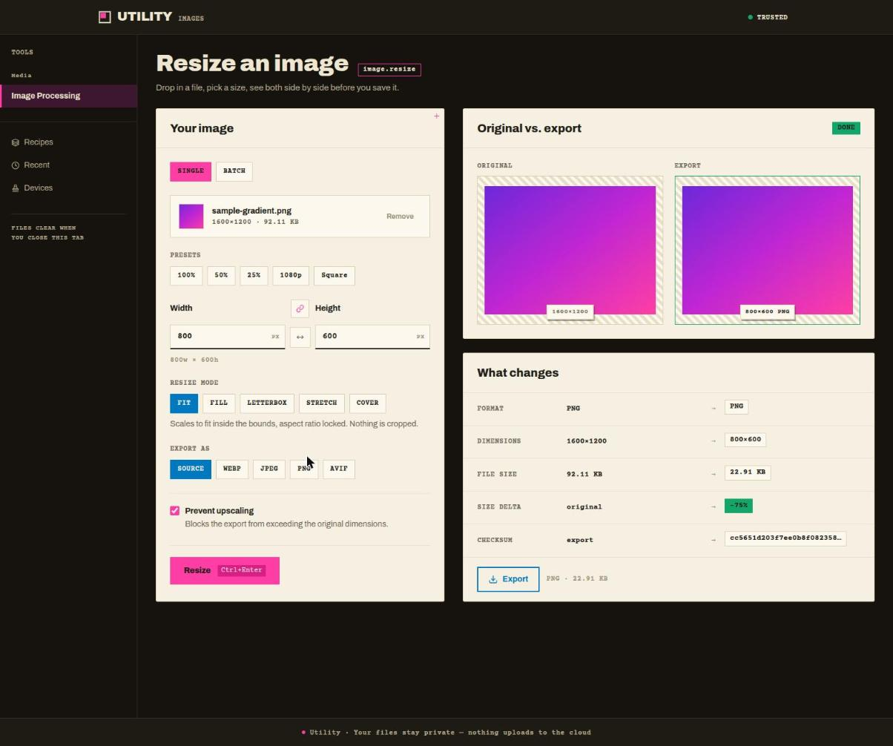
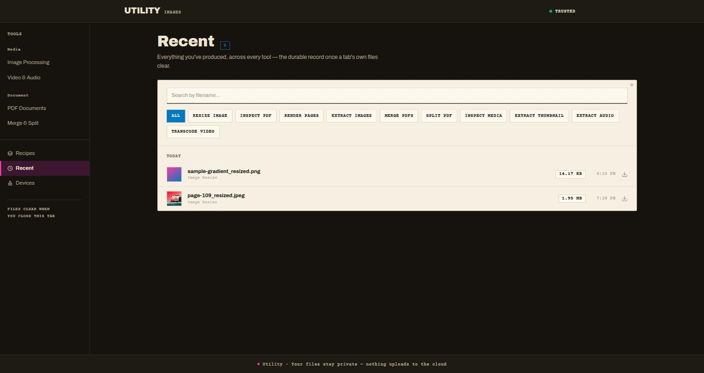
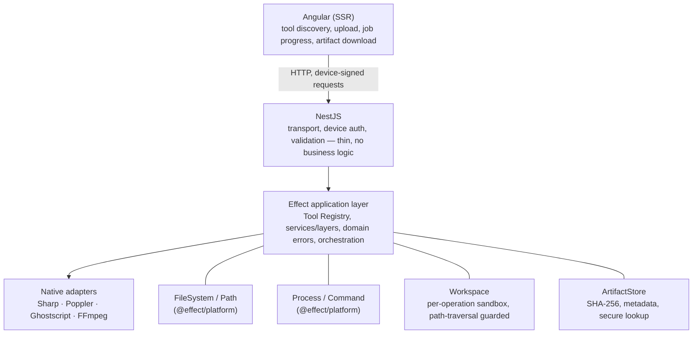

# Utility Platform

**A private, self-hosted media and document toolkit** — image, PDF, and video/audio processing behind a typed tool API, with async jobs, composable recipes, and cryptographic device authentication. Angular 22 (SSR) on the front, NestJS + Effect on the back, running entirely on your own hardware — nothing ever uploads to the cloud.

[](https://angular.dev)
[](https://nestjs.com)
[](https://effect.website)
[](https://www.typescriptlang.org)
[](https://docs.docker.com/compose/)



## What it is

Utility Platform centralizes the file and media operations you'd otherwise reach for a CLI, a cloud converter, or a pile of ad-hoc scripts to do — resizing images, rendering and splitting PDFs, transcoding video, extracting audio — behind one consistent, typed API and a real interface. Every operation is schema-validated end to end, runs in an isolated per-job workspace, and never touches a database: everything lives on your own filesystem.

It's also a full-stack reference architecture: a typed capability-runtime design where Effect owns services, errors, concurrency, and cancellation; NestJS is a thin transport shell; and the browser never touches a shell command or a server filesystem path.

> "The server is a capability runtime, not a command executor." — see [docs/07-security-spec.md](./docs/07-security-spec.md)

## Features

- **Image** — resize, aspect-ratio-aware fit modes, format conversion (WebP/JPEG/PNG/AVIF), before/after comparison with a live size delta and SHA-256 checksum.
- **PDF** — render pages to images, extract embedded images, inspect metadata, merge, split.
- **Video & audio** — inspect, thumbnail capture with a scrubbable preview, audio extraction, transcoding with live progress.
- **Recipes** — chain any single-file operation's output into the next step's input, save it, and re-run it as one job.
- **Jobs** — any operation can run asynchronously with real progress and cancellation, tracked in a persistent footer tray; batch mode fans one submission out into independent per-file jobs.
- **Recent Artifacts** — a searchable, paginated archive of every artifact produced, filterable by the operation that made it.
- **Device authentication** — no accounts, no passwords. Each device generates an ECDSA P-256 keypair in-browser and signs every request; new devices sit pending until the server operator explicitly approves them.
- **Self-hosted, private by construction** — runs behind Caddy on your LAN, optionally reachable over the public internet via Tailscale Funnel with zero inbound port forwarding.



## Design

The frontend is a full risograph-print-studio design system — *The Print Run*: the source file is a plate, each transform is a spot-color pass, the finished artifact is a sheet pulled off the drum and set out to dry. Flat spot-color ink, cut-paper geometry, registration crosses, one ink at a time. See [DESIGN.md](./apps/utility-web/DESIGN.md) for the full system — palette, typography, motion language, and the rules that hold it together.

## Architecture



## Stack

| Layer                | Technology                                                         |
| -------------------- | ------------------------------------------------------------------ |
| Frontend             | Angular 22 (SSR), Tailwind CSS                                     |
| Backend              | NestJS 12                                                          |
| Application layer    | Effect 3 + Effect Schema                                           |
| Runtime capabilities | `@effect/platform` (FileSystem, Path, Command)                     |
| Native adapters      | Sharp · Poppler-utils · Ghostscript · FFmpeg                       |
| Deployment           | Docker Compose, Caddy (reverse proxy + local/public TLS)           |
| Monitoring           | Prometheus + Grafana, LAN-only (`https://<LAN_HOSTNAME>/grafana/`) |
| Language             | TypeScript, end to end                                             |

## Getting started

```bash
npm install
npm run build --workspaces   # builds every package and app

npm run start:api            # NestJS API, watch mode
npm run start:web            # Angular dev server
# or: npm run start          # both, concurrently
```

Native adapters need their system dependencies on the host: `sharp`'s bundled libvips, plus `poppler-utils`, `ghostscript`, and `ffmpeg`. `docker-compose.yml` builds all of that into the API image if you'd rather not install them locally.

## Project structure

```text
apps/
  utility-api/     NestJS API — transport, device auth, composition root
  utility-web/     Angular SSR client
packages/
  domain/          Pure types, brands, error classes
  adapter/         From<T>/Into<T> DTO -> domain conversion traits
  protocol/        Effect Schema contracts (transport-facing)
  runtime/         Effect services: FileSystem, Path, Process, Workspace, ArtifactStore
  toolkit/         Tool/Operation/ToolRegistry, Jobs, Workflows (recipes)
  image/           Sharp adapter + image.resize
  pdf/             Poppler/Ghostscript adapter + PDF operations
  media/           FFmpeg adapter + media operations
```

## Documentation

The full spec set lives in [`docs/`](./docs) — architecture, runtime, Effect layer composition, the tool/job/security models, per-tool specs, the device-auth API reference, and deployment runbooks (LAN, self-hosting checklist, Tailscale Funnel, troubleshooting).
